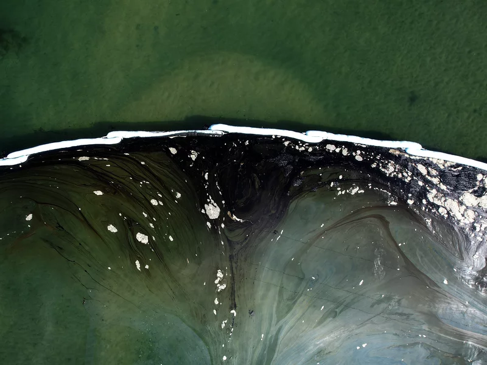

```{r setup, include=TRUE, warning = FALSE, message = FALSE}
knitr::opts_chunk$set(echo = TRUE, warning = FALSE, message = FALSE)

library(tidyverse)
library(here)
library(terra)
library(sf)
library(tmap)
```

# Overview:
***

In this task, we visually explore the location of 2008 oil spill incidents throughout the state of California. First, an interactive map with locations of every 2008 oil spill is generated for the user to explore individual incidents. Next, a choropleth map is created to visualize which CA counties had the highest number of inland oil spill incidents. Data used in this analysis comes from the Office of Spill Prevention and Response (OSPR) online database. An "incident" is defined by the OSPR as "a discharge or threatened discharge of petroleum or other deleterious material into the waters of the state." 

**Source:**
Lampinen, Mark (2020). Oil Spill Incident Tracking [ds394]. California Department of Fish and Game, Office of Spill Prevention and Response. https://gis.data.ca.gov/datasets/CDFW::oil-spill-incident-tracking-ds394-1/about



<br>

```{r}
### Read in and wrangle data!

### read in CA counties
ca_counties_sf <- read_sf(here('task1/ca_counties/CA_Counties_TIGER2016.shp')) %>% 
  janitor::clean_names() %>% 
  ## only keep name and geom
  select(name)

### read in the oil data
oil_spill <- read_csv(here('task1/Oil_Spill_Incident_Tracking_[ds394].csv')) %>% 
  janitor::clean_names()


### change oil spill data to sf so we can plot points
oil_spill_sf <- st_as_sf(oil_spill, coords = c('x','y'),
                         ## set CRS to counties
                         crs = st_crs(ca_counties_sf))

### double-check CRS matches
# st_crs(ca_counties_sf) == st_crs(oil_spill_sf)
# [1] TRUE
```

# Oil spill maps: {.tabset .tabset-fade}
***

## Interactive tmap
```{r}
### change oil spill data to sf
oil_spill_sf <- st_as_sf(oil_spill, coords = c('x','y'),
                         ## set CRS to counties
                         crs = st_crs(ca_counties_sf))

### double-check CRS matches
# st_crs(ca_counties_sf) == st_crs(oil_spill_sf)
# [1] TRUE

### plot oil spill events in CA counties
tmap_mode('view')
tm_shape(ca_counties_sf) +
  tm_borders(lwd = 1, col = 'gray40') +
tm_shape(oil_spill_sf) +
  tm_dots(col = 'darkorchid4', alpha = 0.5) 
```

**Figure 1:** Location of all reported 2008 oil spill incidents within the state of California. More information on each event can be obtained by clicking on the point.


## Choropleth map
```{r}
### return only inland oil spills
oil_spill_land <- oil_spill_sf %>% 
  filter(inlandmari == 'Inland')

### join inland oil data with counties
oil_count_counties_sf <- ca_counties_sf %>% 
  st_join(oil_spill_land) %>% 
  ## summarize number of spills per county
  group_by(name) %>% 
  summarize(spill_events = n())

### create choropleth with color based on count
ggplot(data = oil_count_counties_sf) +
  geom_sf(aes(fill = spill_events)) +
  scale_fill_gradientn(colors = c('gray99', 'orchid1', 'darkorchid4')) +
  labs(fill = "Number of incidents") +
  theme_void()
```

**Figure 2:** Inland 2008 California oil spill events by county. Darker purple color indicates a greater number of spill incidents within that county.
