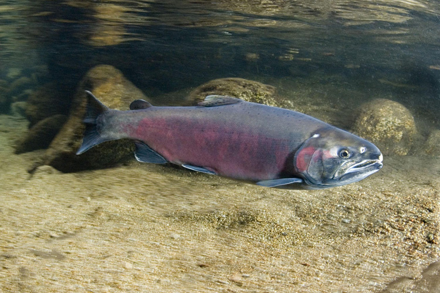
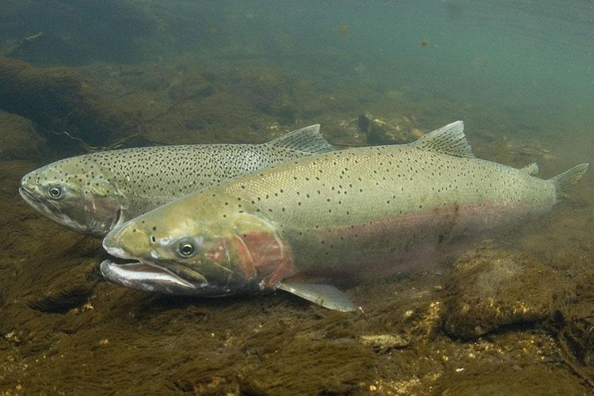

```{r setup, include=TRUE, message = FALSE, warning=FALSE}
knitr::opts_chunk$set(echo = TRUE, message = FALSE, warning = FALSE)
library(tidyverse)
library(lubridate)
library(tsibble)
library(fable)
library(feasts)
```


# Introduction {.tabset}

This task explores Willamette Falls fish ladder passage data, including daily time series data, seasonplots, and annual counts. The data used for this analysis are accessed from the Columbia River Data Access in Real Time (DART) and collected by the Oregon Department of Fish and Wildlife (ODFW). Fish counting occurs at the ladder main viewing window and uses video cameras and time lapsed video to record data 24 hours a day, every day. This analysis specifically examings the passage of adult coho (*Oncorhynchus kisutch*), jack coho, and steelhead (*Oncorhynchus mykiss*) salmon between Jan 1, 2001 and Dec 31, 2010. "Jack" salmon are defined as males that reach sexual maturation and return to spawn in freshwater one year earlier than full-size adult males. These jack coho are identifiable by different coloration (SeaGrant) (https://alaskaseagrant.org/2022/07/research-shows-how-jack-salmon-contribute-to-population-and-genetics/)

[Map of fish]





[pics of the fish?]

**source:** Columbia Basin Research, University of Washington. 2023. DART Adult Passage Graphics & Text. http://www.cbr.washington.edu/dart/query/adult_graph_text


## Original time series

```{r}
### First read in, clean, and wrangle data
fish <- read_csv('willamette_fish_passage.csv')

fish_sub <- fish %>% 
  janitor::clean_names() %>% 
  ## return 3 fish types of interest
  select(date, steelhead, coho, jack_coho) %>% 
  ## replace NAs with 0
  replace(is.na(.), 0)

  
# class(fish_sub$date)
# [1] "character"

### Next, convert date to date class
### and convert df to tsibble (time series df)
fish_ts <- fish_sub %>% 
  mutate(date = lubridate::mdy(date)) %>% 
  as_tsibble(key = NULL, index = date) 

### To plot, pivot so species in same column
fish_ts_long <- fish_ts %>%
  pivot_longer(cols = 2:4, 
               names_to = "species", 
               values_to = "count")


## vector for facet wrap plot labels
spp_labs <- c("Coho", "Jack Coho", "Steelhead")
names(spp_labs) <- c("coho", "jack_coho", "steelhead")


### Finally, visualize data
ggplot(data = fish_ts_long, aes(x = date, y = count, color = species)) +
  geom_line(size = .5) +
  facet_wrap(~species, nrow = 3, labeller = labeller(species = spp_labs)) +
  labs(x = "Date",
       y = "Fish count") +
  ## customize axis with cont 'date' class data
  scale_x_date(limits = as.Date(c('2001-01-01', '2010-12-31')),
               date_breaks = "1 year",
               date_labels = "%Y") +
  scale_color_manual(values = c("salmon2", "pink2", "pink4")) +
  theme_bw() +
  theme(
    axis.title = element_text(face = 'bold'),
    panel.grid.minor.y = element_blank(),
    legend.position = "none"
  )
  
```

**Figure 1:** Time series for adult coho, jack coho, and steelhead salmon passage through the Willamette Falls fish ladder between 2001 and 2010. 

*   There are far fewer jack coho than coho salmon, indicating that occurance of precocial males is uncommon for *O. kisutch*. 
*   The majority of coho salmon (*O. kisutch*) pass through Willamette Falls during a more limited time window (autumn), while steelhead (*O. mykiss*) passage is more spread out and occurs throughout the winter to summer months.
*   There is no obvious correlation between annual patterns of coho and steelhead counts. This relationship could be further explored to more accurately determine if annual population size between these salmon species are significantly correlated.


## Seasonplots


## Annual counts


