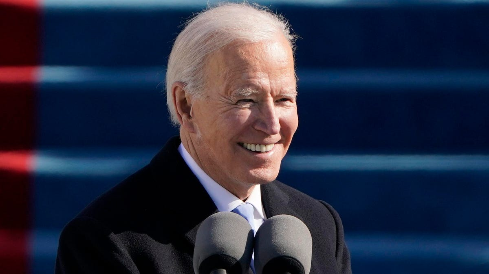

```{r setup, include=TRUE, message = FALSE, warning=FALSE}
knitr::opts_chunk$set(echo = TRUE, message = FALSE, warning = FALSE)
library(tidyverse)
library(readtext)
library(tidytext)
library(textdata)
library(ggwordcloud)
library(cowplot)
```


## Introduction: {.tabset .tabset-pills}
***

In this task, the inaugural addresses from President Biden (2021) and former President Trump (2017) are analysed and directly compared. First, the most frequently used words in both speeches will be determined and visualized in a word cloud. Next, a sentiment analysis will elucidate any major tonal differences between the two speeches. The full text for Biden and Trump's inaugural addresses were sourced from the White House and Politico, respectively.   

### Biden


<br>

### Trump


<br>

## Read in and wrangle data:
***

First we'll read in the txt files of each address, tokenize them, and remove any "stop words" such as "and, a, of" etc. This data subset will then be used for futher analysis.
```{r}
### read in data using `readtext
biden <- readtext("Biden_inaugural_address.txt")
trump <- readtext("Trump_inaugural_address.txt")

### wrangle into dataframe and tokenize
biden_words <- data.frame(biden) %>% 
  ## life-saver that splits up words for you!
  unnest_tokens(word, text, token = 'words') %>%
  ## remove other columns
  select(word)
  
trump_words <- data.frame(trump) %>% 
  unnest_tokens(word, text, token = 'words') %>% 
  select(word)


### remove stop words
biden_words_clean <- biden_words %>% 
  anti_join(stop_words, by = 'word')

trump_words_clean <- trump_words %>% 
  anti_join(stop_words, by = 'word')
```

<br>

## Most common words:
***

Here, we determine the most commonly used words in both presidential addresses. 

```{r}
### count total number of non stop-words 
biden_wordcount <- biden_words_clean %>% 
  count(word)

trump_wordcount <- trump_words_clean %>% 
  count(word)

### find top 50 of words used for both
### returns more bc of tied counts!
biden_top_50 <- biden_wordcount %>% 
  slice_max(order_by = n, n = 50)

trump_top_50 <- trump_wordcount %>% 
  slice_max(order_by = n, n = 50)


### visualize
biden_cloud <- ggplot(data = biden_top_50, aes(label = word)) +
  geom_text_wordcloud(aes(color = n, size = n), shape = 'circle') +
  scale_size_area(max_size = 11) +
  scale_color_gradientn(colors = c("lightblue", "dodgerblue1", "dodgerblue4")) +
  theme_minimal()

trump_cloud <- ggplot(data = trump_top_50, aes(label = word)) +
  geom_text_wordcloud(aes(color = n, size = n), shape = 'circle') +
  scale_size_area(max_size = 11) +
  scale_color_gradientn(colors = c("lightpink2", 'firebrick1', "firebrick4")) +
  theme_minimal()

### combine into one plot
plot_grid(biden_cloud, trump_cloud,
          align = 'v',
          ncol = 1,
          labels = c('Biden:', 'Trump:'))
```

**Figure 1:** The 50 most frequently used words in the past two inaugural addresses, where increased frequency is indicated by text size and color. The top word cloud in blue displays the most common words in Biden's address, while the bottom displays Trump's most commonly used words in red.

As displayed in Figure 1, both inaugural addresses used "america" or "american" the most frequently. Commonly used words in each speech also indicate the context for which they took place, such as "violence" and "virus" appearing multiple times in Biden's inauguration. 

<br>

## Sentiment analysis:
***

Finally, a sentiment analysis using the NRC lexicon can help compare the overall tone of each presidential address. This lexicon associates particular English words with eight basic emotions as well as two sentiments (negative and positive). Not all words used in the inaugural addresses may have an associated value in the lexicon.

```{r}
### load in NRC lexicon
nrc_lex <- get_sentiments(lexicon = "nrc")


### join words to associated sentiment
biden_nrc <- biden_words_clean %>% 
  inner_join(nrc_lex, by = 'word')

trump_nrc <- trump_words_clean %>% 
  inner_join(nrc_lex, by = 'word')

### count how many words for each sentiment
biden_nrc_counts <- biden_nrc %>% 
  count(sentiment) %>% 
  mutate(pct_total = (n/sum(n))*100,
         president = 'Biden')


trump_nrc_counts <- trump_nrc %>% 
  count(sentiment) %>% 
  mutate(pct_total = (n/sum(n))*100,
         president = 'Trump')


### combine counts into one df for plotting
nrc_counts <- biden_nrc_counts %>% 
  rbind(trump_nrc_counts) %>% 
   ## turn sentiments into vector for graph
  mutate(sentiment = factor(sentiment, 
                            levels = c('positive', 'trust', 
                                       'joy', 'surprise', 'anticipation', 
                                       'negative', 'fear', 
                                       'anger', 'sadness', 'disgust')))

### visualize
ggplot(data = nrc_counts, aes(x = pct_total, y = sentiment)) +
  geom_col(aes(fill = president), 
           position = 'dodge',
           alpha = 0.7,
           width = 0.9,
           color = 'gray30') +
  scale_x_continuous(expand = c(0,0)) +
  scale_fill_manual(values = c('dodgerblue3', 'firebrick3')) +
  labs(y = "Sentiment",
       x = "Proprtion of words used") +
  theme_minimal() +
  theme(
    axis.title.y = element_text(face = 'bold', vjust = 3, size = 12),
    axis.title.x = element_text(face = 'bold', vjust = -0.6, size = 12),
    axis.text.y = element_text(face = 'bold.italic', size = 9),
    legend.title = element_blank(),
    legend.position = c(.9,.9),
    legend.text = element_text(size = 10),
    legend.box.background = element_rect(color = 'black'),
    legend.background = element_rect(fill = 'honeydew')
  )


```

**Figure 2:** Comparative sentiment analysis using NRC lexicon for the inaugural addresses of Biden (blue) and Trump (red). The y-axis displays the 10 sentiments within the NRC lexicon, while the x-axis represents the relative proportion of words used with a particular sentiment. Proportions rather than raw word counts were used as the length of these addresses differed substantially. Biden's address contains `r sum(biden_nrc_counts$n)` words with associated sentiments, while Trump's address only contained `r sum(trump_nrc_counts$n)` words with associated sentiments. 

As displayed in Figure 2, Trump's inaugural address contained a proportionally higher amount of positive sentiment and lower amount of negative sentiment. Additionally, words associated with negative emotions such as sadness, anger, and fear were used more commonly by Biden; words associated with positive emotions, such as joy and trust, were more commonly used in Trump's address.

<br>

## Sources:
***
*   The United States Government. (2021, January 21). *Inaugural address by president Joseph R. Biden, Jr.* The White House. Retrieved March 18, 2023, from https://www.whitehouse.gov/briefing-room/speeches-remarks/2021/01/20/inaugural-address-by-president-joseph-r-biden-jr/ 
*   *Full text: 2017 Donald Trump inauguration speech transcript.* POLITICO. (2017, January 20). Retrieved March 18, 2023, from https://www.politico.com/story/2017/01/full-text-donald-trump-inauguration-speech-transcript-233907
*   Crowdsourcing a Word-Emotion Association Lexicon, Saif Mohammad and Peter Turney, *Computational Intelligence*, 29 (3), 436-465, 2013.